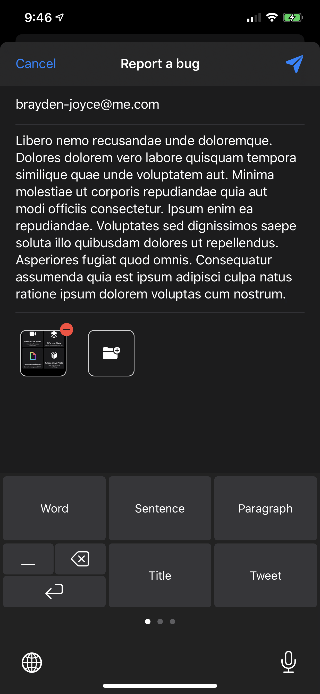

# SupportCenter

<p align="center">
  
</p>

<p align="center">
    
    
    
    
</p>

SupportCenter is the indie developer's solution to in app support. It provides a lightweight UI library that integrates with the [SendGrid API](https://sendgrid.com) so there is no need to need to integrate 3rd party libraries that bloat your app size and expose your users to unwanted tracking.

## Features
* [X] SendGrid integration
* [X] Stand-alone UI components
* [X] Automatic device metadata gathering
* [X] Image and video attachments
* [X] Custom support options
* [X] Dark/Light Interface
* [ ] SwiftUI Support


## Screenshots
<p align="left">
    
    
    
</p>

## Installation

SupportCenter uses Swift Package Manager. 

**Repository URL**
```
https://github.com/aasatt/SupportCenter.git
```

> To add a package dependency to your Xcode project, select File > Swift Packages > Add Package Dependency and enter its repository URL. You can also navigate to your target’s General pane, and in the “Frameworks, Libraries, and Embedded Content” section, click the + button. In the “Choose frameworks and libraries to add” dialog, select Add Other, and choose Add Package Dependency. [See Adding Package Dependencies to Your App - developer.apple.com](https://developer.apple.com/documentation/xcode/adding_package_dependencies_to_your_app)

## Getting Started

### Configuration

Configure the SDK with your SendGrid API Key, support email and from email.

```swift
SupportCenter.setup(
    sendgridToken: <#Sendgrid API Key#>,
    supportEmail: <#Support Email#>,
    fromEmail: <#From Email#>
)
```
**`sendgridToken`**
Your [SendGrid API Key](https://sendgrid.com/docs/API_Reference/Web_API_v3/API_Keys/index.html#API-Keys).

**`supportEmail`**
The email where you would like support requests to be sent to.

**`fromEmail`**
This must be a authenticated sender within SendGrid.
[More information - SendGrid Documentation](https://sendgrid.com/docs/ui/account-and-settings/how-to-set-up-domain-authentication/)

### Presenting SupportCenter

Showing SupportCenter is simple. Be sure you have configured SupportCenter before attempting to present it.

**UIKit**
```swift
SupportCenter.present(from: self)
// Note: self is the current UIViewController
```

**SwiftUI**
```swift
// TODO: SwiftUI code
```

## Advanced Features

### Custom Support Options

Conform to the `ReportOption` protocol to customize the support options shown in the popup. 

**Protocol**
```swift
public protocol ReportOption {
    var icon: UIImage { get }
    var title: String { get }
    var description: String { get }
    var emailSubject: String { get }
}
```

**Example**

Conform to `ReportOption` 
```swift
enum MySupportOption: ReportOption, CaseIterable {

    case betaFeedback

    var icon: UIImage {
        switch self {
        case .betaFeedback:
            return UIImage(systemName: "bubble.left.fill")!
        }
    }

    var title: String {
        switch self {
        case .betaFeedback:
            return "Send Feedback"
        }
    }

    var description: String {
        switch self {
        case .betaFeedback:
            return "Provide feedback for our app"
        }
    }

    var emailSubject: String {
        switch self {
        case .betaFeedback:
            return "Beta Feedback"
        }
    }
}
```

Now just present SupportCenter
```swift
SupportCenter.present(from: self, reportOptions: MySupportOption.allCases)
```