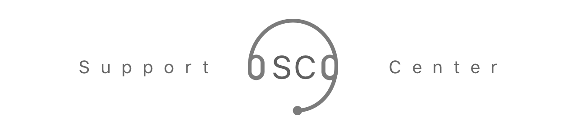
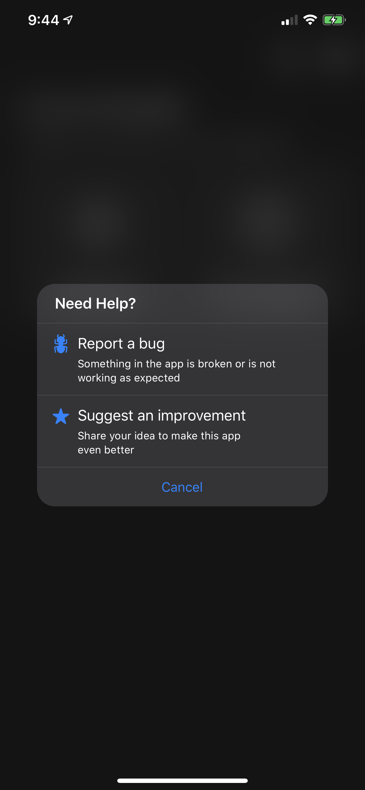
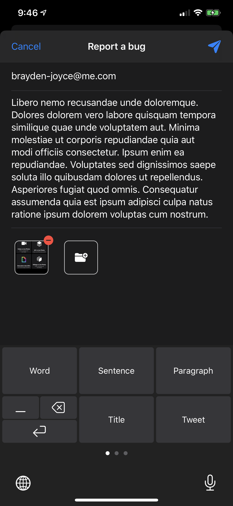
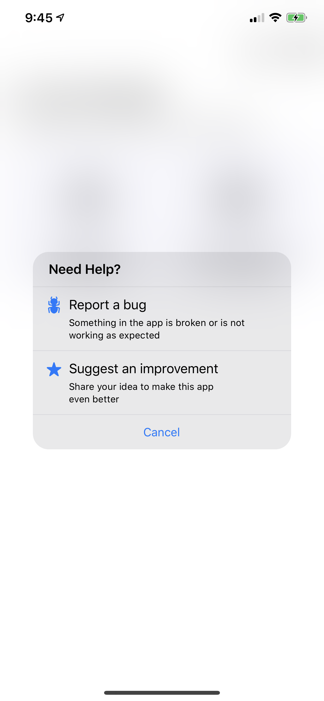

# SupportCenter

<p align="center">
  
</p>

<p align="center">
    
    
    
    
</p>

SupportCenter is the indie developer's solution to in app support. It provides a lightweight UI library that integrates with modern transactional mail providers so there is no need to integrate heavyweight SDKs that bloat your app size and expose your users to unwanted tracking.

## Features
* [X] SMTP2GO integration
* [X] SendGrid integration
* [X] Stand-alone UI components
* [X] Automatic device metadata gathering
* [X] Image and video attachments
* [X] Custom support options
* [X] Dark/Light Interface
* [x] SwiftUI Support
* [ ] Localization


## Screenshots
<p align="left">
    
    
    
</p>

## Installation

SupportCenter uses Swift Package Manager. 

**Repository URL**
```
https://github.com/aasatt/SupportCenter.git
```

> To add a package dependency to your Xcode project, select File > Swift Packages > Add Package Dependency and enter its repository URL. You can also navigate to your target’s General pane, and in the “Frameworks, Libraries, and Embedded Content” section, click the + button. In the “Choose frameworks and libraries to add” dialog, select Add Other, and choose Add Package Dependency. [See Adding Package Dependencies to Your App - developer.apple.com](https://developer.apple.com/documentation/xcode/adding_package_dependencies_to_your_app)

## Getting Started

### Configuration

Configure the SDK with your preferred mail provider, support email, and from email address. SupportCenter ships with helpers for SMTP2GO (recommended) and SendGrid.

```swift
let mailServer = SupportCenter.setup(
    smtp2goAPIKey: <#SMTP2GO API Key#>,
    supportEmail: <#Support Email#>,
    fromEmail: <#From Email#>
)
```
Store the returned `MailServer` instance and pass it into the presentation helpers.

**`smtp2goAPIKey`**
Your [SMTP2GO API Key](https://developers.smtp2go.com/docs/getting-started).

**`supportEmail`**
The email where you would like support requests to be sent to.

**`fromEmail`**
The verified sender address configured with your mail provider.

> Still using SendGrid? You can create a `MailServer` with `SupportCenter.setup(sendgridToken:supportEmail:fromEmail:)` instead.

SupportCenter targets Swift 6’s strict concurrency model, so keep your mail server reference somewhere that’s safe to access from the main actor (e.g. a property on your view model or coordinator).

### Presenting SupportCenter

Showing SupportCenter is simple. Be sure you have configured SupportCenter before attempting to present it.

**UIKit**
```swift
SupportCenter.present(with: mailServer, from: self)
// Note: self is the current UIViewController
```

**SwiftUI**

Easily present from SwiftUI via a wrapping `UIViewControllerRepresentable` view.

```swift
struct SupportView: UIViewControllerRepresentable {
    @Binding var presentingSupport: Bool
    let mailServer: MailServer

    func makeUIViewController(context: Context) -> WrappingViewController {
        let controller = WrappingViewController(mailServer: mailServer)
        controller.onDismiss = {
            presentingSupport = false
        }
        return controller
    }

    func updateUIViewController(_ uiViewController: WrappingViewController, context: Context) {
        if presentingSupport {
            uiViewController.present()
        }
    }
}

final class WrappingViewController: UIViewController, SupportCenterViewControllerDelegate {
    private let mailServer: MailServer
    var onDismiss: (() -> Void)?

    init(mailServer: MailServer) {
        self.mailServer = mailServer
        super.init(nibName: nil, bundle: nil)
    }

    @available(*, unavailable)
    required init?(coder: NSCoder) {
        fatalError("init(coder:) has not been implemented")
    }

    override func viewWillAppear(_ animated: Bool) {
        super.viewWillAppear(animated)
        present()
    }

    func present() {
        // metadata is captured automatically by SupportCenter
        SupportCenter.present(with: mailServer, from: self, delegate: self)
    }

    func supportCenterDidDismiss() {
        onDismiss?()
    }
}
```

Then put your view's content and the support view in a `ZStack` and show the support view based on a `presentingSupport` state variable.

```swift
struct DemoView: View {
    @State private var presentingSupport = false
    let mailServer: MailServer

    var body: some View {
        ZStack {
            Button("Support") {
                presentingSupport = true
            }

            if presentingSupport {
                SupportView(presentingSupport: $presentingSupport, mailServer: mailServer)
            }
        }
    }
}

```


## Advanced Features

### Custom Support Options

Conform to the `ReportOption` protocol to customize the support options shown in the popup. 

**Protocol**
```swift
public protocol ReportOption {
    var icon: UIImage { get }
    var title: String { get }
    var description: String { get }
    var emailSubject: String { get }
}
```

**Example**

Conform to `ReportOption` 
```swift
enum MySupportOption: ReportOption, CaseIterable {

    case betaFeedback

    var icon: UIImage {
        switch self {
        case .betaFeedback:
            return UIImage(systemName: "bubble.left.fill")!
        }
    }

    var title: String {
        switch self {
        case .betaFeedback:
            return "Send Feedback"
        }
    }

    var description: String {
        switch self {
        case .betaFeedback:
            return "Provide feedback for our app"
        }
    }

    var emailSubject: String {
        switch self {
        case .betaFeedback:
            return "Beta Feedback"
        }
    }
}
```

Now just present SupportCenter
```swift
SupportCenter.present(with: mailServer, from: self, reportOptions: MySupportOption.allCases)
```
